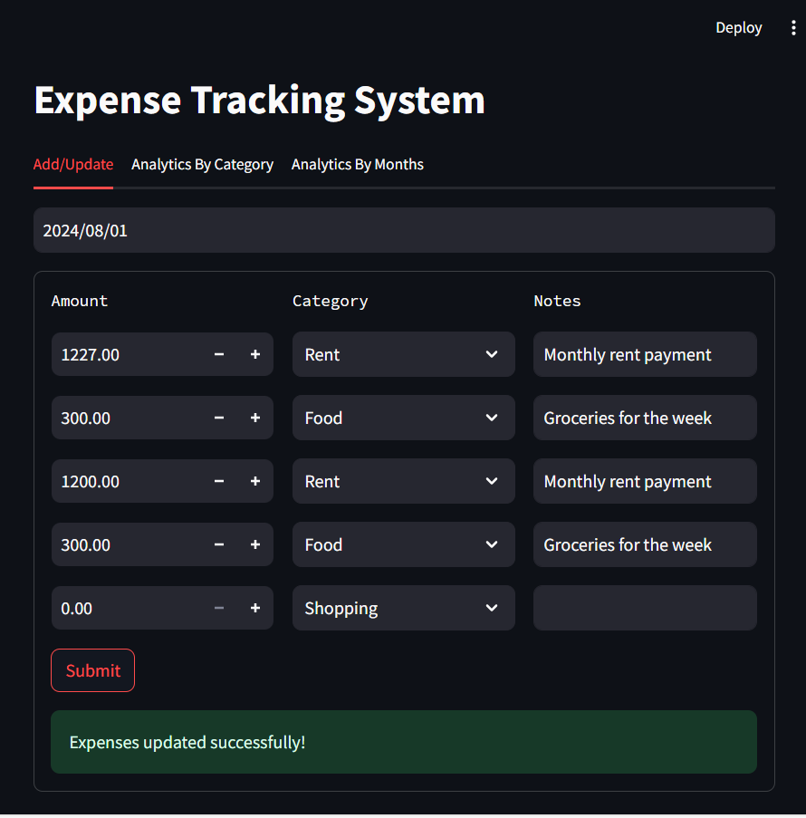
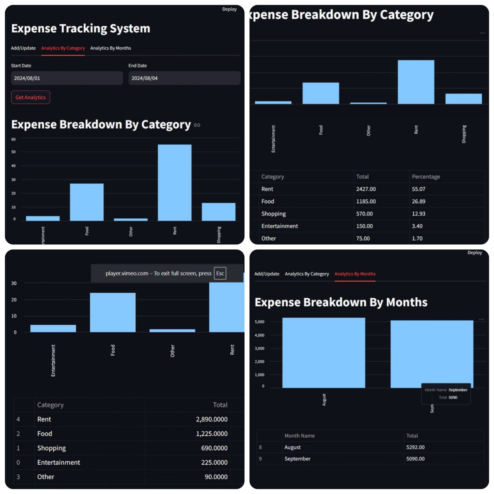

# BudgetFlux

**BudgetFlux** is a full-stack **expense management system** built with **FastAPI** for a high-performance backend, **Streamlit** for an interactive and user-friendly frontend, and a **SQL database** for secure, persistent data storage.

It is designed to make expense tracking fast, simple, and insightful — allowing users to log expenses, categorize them, and review analytics by category and month.

## Project Structure

The repository is organized as follows:

- **frontend/**: Houses the Streamlit application code for the interactive user interface.
- **backend/**: Contains the FastAPI server code for handling API requests and data processing.
- **tests/**: Includes test cases to ensure the reliability of both frontend and backend components.
- **images/**: Stores images used in the README (e.g., screenshots).
- **requirements.txt**: Lists all necessary Python dependencies for the project.
- **README.md**: This file, providing an overview and setup instructions.

## Screenshots

Take a look at the BudgetFlux interface in action:

  
*Form's interface that allows users to add new expenses or update existing ones easily.*

  
*Combined visual showing both category-wise and month-wise expense breakdowns for deeper financial insights.*

## Getting Started

Follow these steps to set up and run the project locally:

1. **Clone the Repository**  
   Begin by cloning the project to your local machine:  
   ```bash
   git clone https://github.com/yourusername/BudgetFlux.git
   cd BudgetFlux
2. **Install dependencies:**:   
   ```commandline
    pip install -r requirements.txt
   ```
3. **Run the FastAPI server:**:   
   ```commandline
    uvicorn server.server:app --reload
   ```
4. **Run the Streamlit app:**:   
   ```commandline
    streamlit run frontend/app.py
   ```
